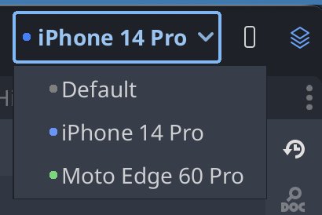
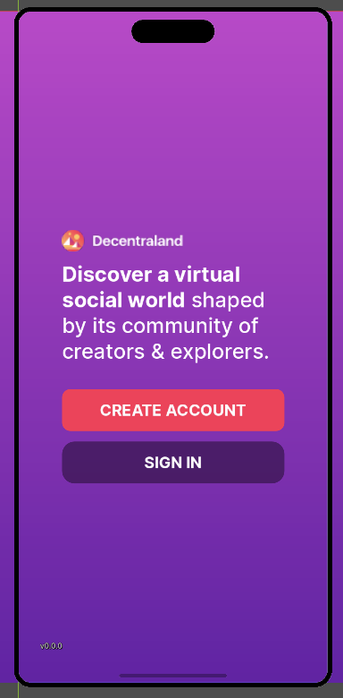
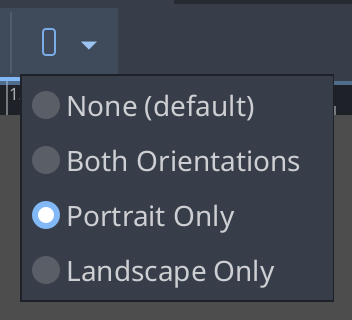

# Mobile Preview Plugin

Preview how your UI looks on mobile devices directly in the Godot editor.

## Toolbar Controls

When the plugin is enabled, three controls appear in the editor toolbar:

### Device Selector

Pick a device to preview. Each device sets the viewport to match a real phone's resolution and aspect ratio.

- **Default** — 720x720, no phone emulation
- **iPhone 14 Pro** — iOS safe areas, Dynamic Island, home indicator
- **Moto Edge 60 Pro** — Android safe areas, camera hole

### Orientation Toggle

Click the phone icon to switch between portrait and landscape. Only available when the scene has an orientation set (see below).

### Overlay Toggle

Click the layers icon to show/hide the phone frame overlay. The overlay draws rounded corners, bezels, and device-specific features (Dynamic Island, camera hole) over the 2D viewport.

## Scene Orientation

Each scene can have its own orientation setting, accessible from the scene menu bar (next to the 2D/3D toolbar).

| Option | Behavior |
|--------|----------|
| **None (default)** | No phone emulation. Viewport stays at 720x720. |
| **Both Orientations** | Portrait and landscape. Toggle freely with the toolbar button. |
| **Portrait Only** | Locks to portrait. |
| **Landscape Only** | Locks to landscape. |

The orientation is saved as scene metadata, so each `.tscn` file remembers its own setting.

## How @tool Scripts React

When a device is selected, the plugin sets `_mobile_preview/active` and related project settings. These are read by `@tool` scripts in the editor:

- **OrientationContainer** — switches between horizontal/vertical layout
- **HideOrientation** — hides controls that don't apply to the current orientation
- **CleanOrientation** — same as HideOrientation but uses `queue_free` at runtime
- **SafeMarginContainer** — applies safe area margins matching the selected device

These scripts restore their original values before saving, so they never dirty `.tscn` files.

## Quick Start

1. Enable the plugin in **Project > Project Settings > Plugins**
2. Select **iPhone 14 Pro** or **Moto Edge 60 Pro** from the device dropdown
3. Open a UI scene and set its orientation from the scene menu (e.g. **Portrait Only**)
4. The viewport resizes and the phone overlay appears
5. Use the orientation toggle to flip between portrait/landscape (if allowed)
6. Use the overlay toggle to show/hide the phone frame
